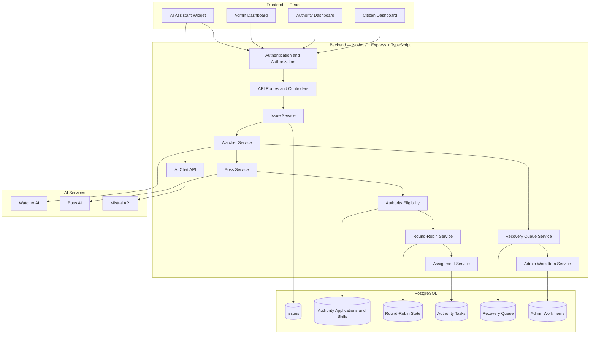
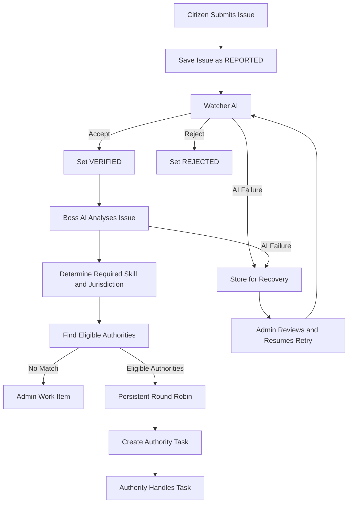
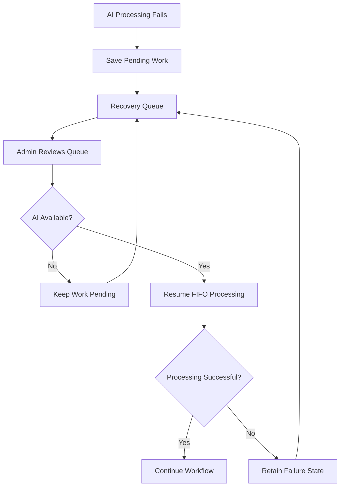

# UrbanShield AI 🌍

**AI-Assisted Civic Issue Management with Human-in-the-Loop Recovery**

UrbanShield AI connects citizens, authorities and administrators to manage environmental civic issues through AI-assisted verification, intelligent task assignment and recoverable workflows.

Built for **Environmental Hacks — Bharat Builds Tour, powered by AWS.**

## The Problem

Reporting an environmental issue is only the first step. Issues also need verification, prioritization, assignment and follow-up.

AI introduces another challenge: if an AI service becomes unavailable, pending work should not be lost or permanently blocked.

## Our Solution

UrbanShield AI provides a structured workflow for:

* Citizen issue reporting with location and photo evidence.
* AI-assisted issue verification using Watcher.
* Issue analysis and task preparation using Boss.
* Skill- and jurisdiction-based authority eligibility.
* Persistent round-robin task assignment.
* Admin intervention when automated processing cannot continue.
* FIFO recovery queue for retrying pending AI work.
* Role-specific dashboards for citizens, authorities and admins.

**Core idea:** AI handles routine processing. Humans handle exceptions. Pending work remains recoverable.

## System Architecture

*The diagram represents the logical architecture. External AI integrations and queue storage must match the actual deployed implementation.*

## AI Verification and Assignment Workflow

### How the AI Workflow Works

**1. Watcher — Verification**

Evaluates the submitted civic issue and returns a structured acceptance or rejection decision. The issue status is updated only when the database state permits the transition.

**2. Boss — Task Intelligence**

Analyses verified issues and identifies the required authority skill, jurisdiction, estimated duration and complexity.

**3. Eligibility — Deterministic Rules**

Filters verified authorities using required skills, jurisdiction and availability. AI does not directly choose an unauthorized or ineligible authority.

**4. Round Robin — Fair Assignment**

Uses persistent PostgreSQL state to distribute assignments across eligible authorities instead of relying on in-memory counters.

**5. Assignment — Task Creation**

Creates an authority task with protection against duplicate active assignments.

## AI Recovery Queue

AI service availability should not determine whether civic work survives.

The recovery workflow is designed to provide:

* **FIFO ordering:** Older pending items are processed first.
* **Admin control:** Administrators can inspect pending work and resume processing.
* **Failure visibility:** Failed items should remain identifiable and recoverable.
* **Duplicate protection:** Retries should not create duplicate tasks or administrative work items.
* **Workflow continuity:** Issues requiring human judgment can be handled through the Admin work-item workflow.

The queue and Admin work items serve different purposes: the queue preserves pending work for retry, while Admin work items track work that requires intervention.

## Environmental Impact

UrbanShield AI focuses on environmental civic issues such as:

* Water leakage and drainage.
* Flooding and waterlogging.
* Extreme heat and related civic risks.
* Other locally reported environmental problems.

The dashboard can use actual issue records to show:

* Total reported issues.
* Pending and resolved issues.
* Three-day reporting trends.
* Repeated reports by location.
* Areas that may require investigation.

Historical issue patterns are not weather forecasts. Future rainfall, temperature, AQI or flood predictions should only be shown when supported by a reliable data source.

## Dashboard AI Assistant

The bottom-right AI assistant is designed to help users understand civic issues and relevant environmental information.

* **Citizen:** Understand issue reporting, status and relevant precautions.
* **Authority:** Summarize authorized issue data and assigned work.
* **Admin:** Review issue patterns and administrative workload.

The assistant uses the Mistral API through the backend when that integration is configured. It is separate from the Watcher/Boss automated verification and assignment pipeline.

## User Roles

| Role      | Main responsibilities                                                               |
| --------- | ----------------------------------------------------------------------------------- |
| Citizen   | Submit issues, provide evidence and track personal reports                          |
| Authority | Review relevant issues and manage assigned tasks                                    |
| Admin     | Verify authority applications, monitor workflows and handle administrative handoffs |

Access is controlled through the project's existing authentication and authorization implementation. **Keycloak is not used.**

## Technology Stack

| Layer                  | Technology                                                       |
| ---------------------- | ---------------------------------------------------------------- |
| Frontend               | React, TypeScript                                                |
| Backend                | Node.js, Express, TypeScript                                     |
| Database               | PostgreSQL                                                       |
| AI orchestration       | LangGraph                                                        |
| Watcher and Boss       | OPENROUTER integration                                               |
| Dashboard AI assistant | Mistral API integration                                          |
| Validation             | Zod                                                              |
| Image storage          | ImageKit                                                         |
| Assignment             | PostgreSQL-backed round robin                                    |
| Infrastructure         | AWS component to be specified according to the actual deployment |

## Reliability and Security

* AI credentials remain on the backend.
* Role permissions are enforced by the backend.
* Authority eligibility is checked using deterministic rules.
* Assignment and administrative handoff operations use duplicate protection.
* AI errors are normalized rather than exposing raw provider errors.
* Pending work can be recovered instead of requiring citizens to recreate reports.
* Sensitive personal information is not needed for civic issue classification.

## AWS Integration

**AWS service or open-source tool:** [Add the actual service/tool used]

**Purpose:** [Explain its role in the deployed application]

**Deployment or evidence:** [Add the actual deployment URL or architecture evidence]

Only include integrations that are genuinely implemented and demonstrable.

## Team

**Anand Raj** — Backend, AI Workflow and DevOps
GitHub: https://github.com/anandrajjee981-max

**Rishikesh Pal** — Frontend Development
GitHub: https://github.com/rishikesh-Dev01

## Hackathon

**Environmental Hacks — Bharat Builds Tour, powered by AWS**
Organized by WeMakeDevs.

**Track:** Heat & Water

## Our Goal

UrbanShield AI aims to turn civic reports into actionable work by connecting citizens, authorities and administrators through AI-assisted processing and human-controlled recovery.

**AI may fail. The workflow should not lose the work.**

#BharatBuilds #EnvironmentalHacks #AWS #WeMakeDevs #ClimateTech #CivicTech
